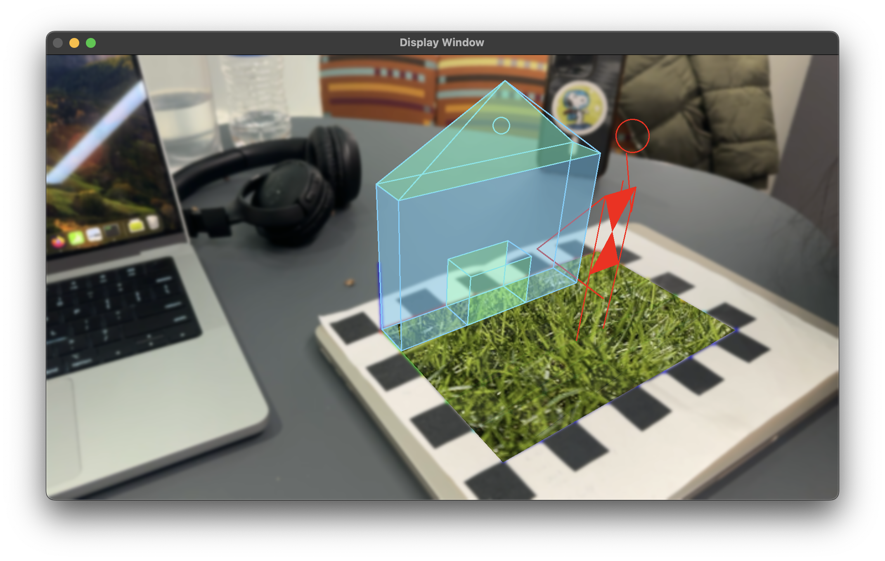

# CS5330ComputerVision

CS5330 Pattern Recognition and Computer Vision

* Project 1: Video Special Effects
* Project 2: Content Based Image Retrieval
* Project 3: Object Recognition
* Project 4: Calibration and Augmented Reality


* Project 5: Pattern Recognition using Deep Learning


To build and run a particular project,

Create a new build directory inside the project and excute the binary:

```
mkdir build
cd build

cmake ..
make
./OpenCVTest
```

---

To simple test program, you can use direct method (note that you need to specify all dependent files and lib):

```
g++ -std=c++11 main.cpp -o app `pkg-config --cflags --libs opencv4`

g++ -std=c++11 main.cpp src/faceDetect.cpp src/filter.cpp src/imgDisplay.cpp src/vidDisplay.cpp -Iinclude -o app `pkg-config --cflags --libs opencv`
```
